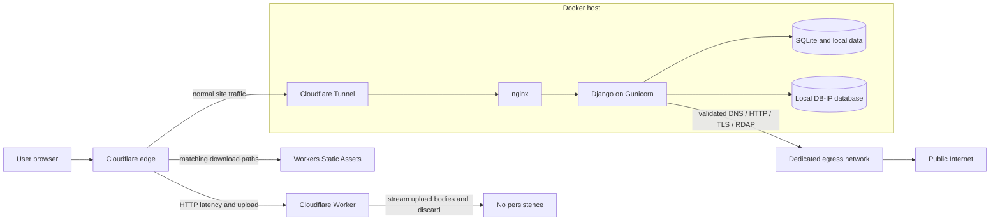

# WhatWebSees

WhatWebSees is a privacy-focused Django application for understanding what websites, browsers, networks, DNS and public infrastructure expose during normal web use. It combines browser-side inspection with bounded server-side diagnostic tools and plain-language explanations.

**Live website:** [https://whatwebsees.com/](https://whatwebsees.com/)

## Project purpose

I built WhatWebSees to make everyday web and network behavior observable without turning diagnostics into another source of unnecessary data collection. The project is both a practical public tool suite and a production-oriented demonstration of careful proxy handling, SSRF-resistant outbound requests, browser privacy boundaries and small-stack operations.

The site favors useful, transparent results over certainty it cannot provide. IP location is labeled approximate, browser detection accounts for reduction and spoofing, and the edge-backed speed test describes the infrastructure path it actually measures.

## Features

- Browser and device checks for User-Agent, screen and viewport, privacy signals, WebGL and canvas behavior.
- IP and network tools for address classification, local GeoIP lookup, DNS, DNSSEC, reverse DNS, subnets and hostname resolution.
- Website diagnostics for HTTP status, redirect chains, TLS certificates, response/security headers, robots.txt, sitemaps and metadata.
- Domain and email diagnostics using bounded RDAP and DNS lookups.
- Local utilities for password heuristics, URL parsing, file hashing, Punycode and download-time calculations.
- A first-party browser speed test using Cloudflare Workers Static Assets for downloads and Worker code for HTTP latency and bounded uploads.
- Evergreen learning guides and a glossary connected to relevant tools.

The tool index is available at [whatwebsees.com/tools/](https://whatwebsees.com/tools/) and the educational section at [whatwebsees.com/learn/](https://whatwebsees.com/learn/).

## What runs where

Browser-side tools keep sensitive or naturally local values in the page wherever practical. Screen data, browser summaries, password analysis, file hashing, URL parsing, canvas output and download-time calculation do not need to send their assembled results to Django.

Server-side access is used only when the task requires it: Django performs DNS and RDAP queries, public-site HTTP/TLS checks, local GeoIP database reads and allowlisted request metadata. Speed-test traffic is handled separately at Cloudflare's edge. Diagnostic submissions are not written to application models or lookup-history tables.

## Architecture



Production traffic follows Cloudflare → Cloudflare Tunnel → nginx → Gunicorn/Django. Cloudflared and nginx share the `edge` network; nginx and Django share the Docker-internal `backend` network. Gunicorn has no host port, and nginx is published only on `127.0.0.1:8080` for host-local diagnostics.

The `/speed-test/*` route is intentionally intercepted before the Tunnel. Download data follows browser → Cloudflare Workers Static Assets, while latency and upload requests follow browser → Worker; upload bodies are counted as streams and discarded. Matching assets are served without Worker-script execution. This separation prevents limited application-origin upload capacity from becoming the bottleneck of an Internet download measurement. If edge routing or a required backend marker is absent, the browser refuses the result, and Django's legacy download fallback returns a small marked `503` instead of serving test bytes.

Django also joins a separate `egress` network for tools that must contact public DNS, HTTP, TLS or RDAP services. This keeps the internal backend network isolated while making outbound capability explicit. Network separation is only one layer: application code still validates schemes, ports, DNS answers, addresses and every redirect before connecting.

Persistent runtime data is mounted from `./data` to `/data`. The SQLite file and local GeoIP database are intentionally excluded from Git.

## Technology stack

- Python 3.13 and Django 5.2
- Gunicorn
- nginx
- Docker Compose
- Cloudflare Tunnel
- Cloudflare Workers and Workers Static Assets for the speed test
- SQLite
- dnspython and maxminddb
- Vanilla HTML, CSS and JavaScript
- Local DB-IP City Lite data

No Node build is used by the Django site, and no SPA framework, task queue or external cache is required. Node is used only to test and deploy the isolated Worker module.

## Privacy and security design

Implemented safeguards include:

- Required secrets are read from environment variables and kept outside Git.
- Cloudflare Tunnel ingress avoids exposing Django directly to the public Internet.
- nginx normalizes the trusted visitor-address and original-protocol headers before Django sees them.
- CSRF middleware protects server-rendered POST forms.
- Private diagnostic responses use `private`/`no-store` caching where appropriate; internal endpoints also return `X-Robots-Tag: noindex, nofollow`.
- Request and response metadata is returned through explicit allowlists; cookies and authorization fields are not echoed.
- Browser-sensitive analysis remains client-side where the task does not require a server.
- nginx rate limits origin-side outbound diagnostic POST routes. Edge speed-test requests require separate Cloudflare-side rate limiting because they do not reach nginx.
- The application does not persist visitor IPs, test results, submitted passwords, file contents or a diagnostic lookup history.
- Optional Google Analytics loads only after browser-stored consent.

This design reduces exposure; it is not a claim that the application is “100% secure” or that use is anonymous. Cloudflare, the host and operational error handling can still process network metadata. nginx and Gunicorn access logs are disabled in the repository configuration, while warning/error logs remain available for operations.

### Network and SSRF protection

User-directed outbound HTTP/TLS tools share a defensive connection layer that:

1. Accepts only HTTP or HTTPS on standard ports and rejects credentials or internal hostname forms.
2. Resolves a hostname once and rejects the target if any returned address is non-public, private, loopback, link-local, multicast, reserved or otherwise unsuitable.
3. Connects to a validated numeric address while retaining the original hostname for the HTTP `Host` field, TLS SNI and certificate validation.
4. Repeats normalization, DNS validation and public-address checks for every redirect target.
5. Enforces short connect/read/total timeouts, a fixed redirect ceiling and bounded response bodies.
6. Exposes only selected safe response headers and never returns `Set-Cookie`.

DNS queries have bounded resolver lifetimes, reverse DNS accepts only public addresses, and RDAP uses IANA-discovered HTTPS services through the same safe HTTP layer.

### Edge speed test controls

The edge project deploys four generated, incompressible binary files as Workers Static Assets: 1 MiB, 4 MiB, 16 MiB and 24 MiB. The files are below the 25 MiB individual-asset limit and excluded from Git. Matching download paths are asset-first and do not invoke Worker code. The Worker itself exposes only a minimal HTTP-latency response and a bounded upload consumer. Each upload request is capped at 16 MiB both from declared `Content-Length` and actual streamed bytes; upload bodies are never stored, forwarded or returned.

Static downloads identify themselves with `X-WWS-Speedtest-Backend: cloudflare-static-asset`; dynamic ping and upload responses use `cloudflare-worker`. Both are non-cacheable and non-indexable. The browser refuses to show a measurement if the expected marker is missing or differs. No speed-test endpoint accepts a remote URL or arbitrary asset name, and Django's legacy same-path fallback returns only a `503` marked `django-fallback`.

The browser discards the first of five HTTP latency samples, then uses the median of the remaining requests. After a 1 MiB warm-up, download stages progress through 1 × 1 MiB, 2 × 4 MiB, 3 × 16 MiB and 4 × 24 MiB. Throughput is actual bytes divided by the concurrent stage's wall-clock response-body duration—not an average of individual streams and not initial time to headers. Upload stages use bounded browser-generated, non-compressible data and browser timing; the Worker reports only acknowledged bytes. A complete fastest-path run is bounded to 154 MiB downloaded, 54 MiB uploaded and 35 seconds, while slower connections normally stop much earlier. Results remain in the page.

The checked-in edge service cannot rely on nginx abuse controls because its route executes first at Cloudflare. Before production use, consider Cloudflare-side rate limits for the exact ping, download and upload paths, allow enough short bursts for one adaptive run, and apply stricter sustained per-IP limits where the account provides suitable controls. Monitor dynamic Worker invocations and bandwidth, then tune the thresholds.

Cloudflare currently documents Static Asset requests as free and unlimited with no additional asset-storage charge. The dynamic ping and upload requests remain subject to Workers Free limits, including the current daily request quota. Missing edge responses or quota errors fail the browser test because the required backend marker is absent; they cannot silently become an origin measurement. This speed-test design does not require Workers Paid or a usage-based storage product, but that does not imply every Cloudflare product or configuration is free.

## Configuration

Copy `.env.example` to an untracked `.env` and set these names:

| Variable | Purpose |
| --- | --- |
| `DJANGO_SECRET_KEY` | Required Django cryptographic secret; generate a unique production value. |
| `DJANGO_DEBUG` | Django debug mode; keep disabled in production. |
| `DJANGO_ALLOWED_HOSTS` | Comma-separated hostnames accepted by Django. |
| `CLOUDFLARE_TUNNEL_TOKEN` | Token used only by the cloudflared container. |

Do not commit `.env`, origin certificates, private keys, runtime databases or tunnel credentials. The Compose file passes only Django settings to the web container; the tunnel token is isolated to cloudflared.

The application expects persistent data below `/data`. IP geolocation works when a DB-IP City Lite MMDB is present at `/data/geoip/dbip-city-lite.mmdb`; lookup pages degrade without inventing a result if the database is unavailable.

## Local development with Docker

Prerequisites are Docker Engine and the Docker Compose plugin.

```sh
cp .env.example .env
# Edit .env locally and replace every placeholder.
docker compose build
docker compose up -d
docker compose ps
curl --fail http://127.0.0.1:8080/health
```

The production-like stack includes `web`, `nginx` and `cloudflared`. A valid tunnel token is needed for cloudflared to connect, but the loopback nginx path can still be used for local diagnostics when the web and nginx services are healthy.

To stop the local stack:

```sh
docker compose down
```

## Testing

Run checks inside the web image or from a Python environment containing `app/requirements.txt`:

```sh
cd app
python manage.py check
python manage.py test
python manage.py makemigrations --check --dry-run
```

Validate nginx separately from the repository root:

```sh
docker compose exec -T nginx nginx -t
```

The suite covers public rendering and metadata, caching/indexing headers, proxy behavior, client IP normalization, local GeoIP handling, DNS and HTTP safety, redirect revalidation, parser bounds, the fail-closed speed-test fallback and nginx rate-limit configuration. The nginx source-file test intentionally skips inside the Django image because deployment configuration is not copied into that image.

Test the Worker separately without Cloudflare credentials:

```sh
cd cloudflare/speed-test-worker
npm install
npm run assets:generate
npm run check
npm test
```

## Deployment

The checked-in Compose topology is intended for a Debian host:

1. Provide untracked production environment values and the local GeoIP database.
2. Build the Django image and start the Compose services.
3. Configure the remotely managed Cloudflare Tunnel hostname to use `http://nginx:80`.
4. Keep the host binding at loopback unless the ingress design is deliberately changed.
5. Validate Django, nginx, health checks and proxy-derived address/protocol behavior before serving traffic.
6. Install the optional systemd timer only after reviewing `ops/update-dbip-lite.sh` and its fixed project path. The updater validates a new MMDB, keeps a rollback copy, replaces atomically and restarts the web service.

### Cloudflare speed-test deployment

The edge speed test has its own manual deployment procedure in [`cloudflare/speed-test-worker/README.md`](cloudflare/speed-test-worker/README.md). In summary, generate the four ignored Static Asset payloads, verify their sizes, dry-run and deploy the combined assets/Worker project, confirm the `whatwebsees.com/speed-test/*` route uses fail-closed behavior, and verify the separate static and dynamic backend markers. None of those account operations are performed by the Django deployment.

## Project structure

```text
.
├── app/
│   ├── config/                 # Django settings and URL root
│   ├── core/                   # Views, safety utilities, tests and templates
│   ├── Dockerfile
│   ├── manage.py
│   └── requirements.txt
├── cloudflare/speed-test-worker/ # Edge latency/download/upload service
├── data/                       # Ignored runtime SQLite / GeoIP data
├── nginx/default.conf          # Reverse proxy, trusted headers and rate limits
├── ops/                        # GeoIP updater and systemd units
├── compose.yaml                # web, nginx, cloudflared and network topology
└── .env.example                # Variable names and non-secret placeholders
```

## Limitations

- IP geolocation is database-dependent and approximate; it is not GPS or proof of residence.
- User-Agent, platform and architecture values can be reduced, frozen or spoofed by browsers.
- Server-side status and redirect timings reflect the WhatWebSees origin path, not a visitor's browser timing.
- The speed test measures the browser-to-Cloudflare path used by WhatWebSees. Edge location, routing, VPN, Wi-Fi, browser load, parallelism and bounded test duration can make it differ from another provider or an ISP line rate.
- The current Gunicorn deployment uses two synchronous workers. nginx buffering protects them from slow-client streaming, but capacity and bandwidth still require production monitoring.
- SQLite is appropriate for the current write-light application; it is not presented as a general high-write architecture.
- The repository does not include a production GeoIP database, `.env`, Cloudflare account settings or host firewall configuration.

## Roadmap

- Continue improving high-value existing tools based on real usage rather than creating thin keyword pages.
- Add browser-level JavaScript tests for interactive tools and accessibility states.
- Add deployment observability that minimizes retained visitor data.
- Revisit storage and worker topology only if measured production load requires it.
- Select an explicit open-source license before inviting broad reuse or contributions.

## License

An open-source license has not yet been selected. Until one is added, the repository should not be assumed to grant reuse rights beyond those provided by applicable law.
